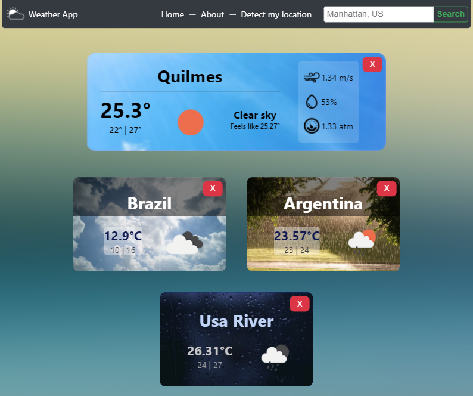
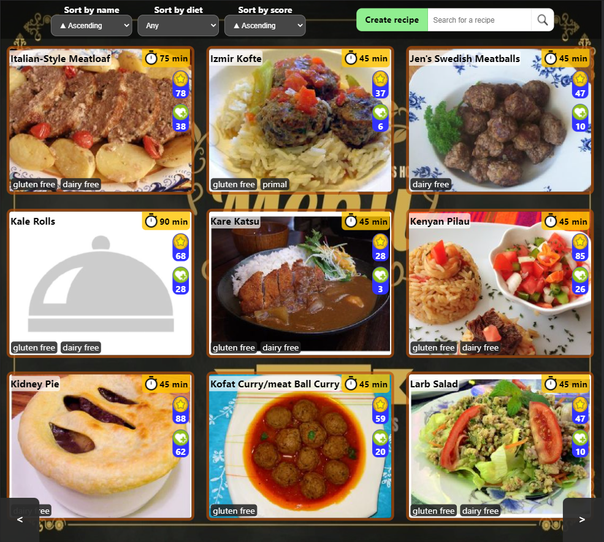
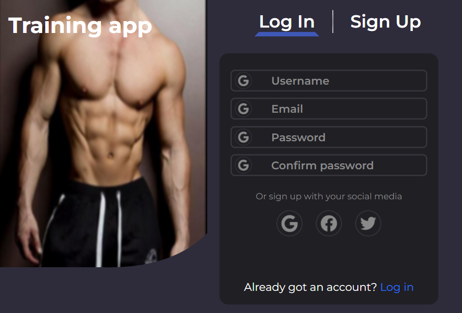
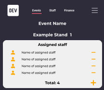

# Welcome to my GitHub!

## 🚀 About Me

I'm a **FullStack Developer** from Argentina, with experience in **Frontend** and **Backend** 
Web Application Development. I'm currently looking for a **job opportunity**
where I can keep **improving my skills** by constantly facing **new challenges**, and applying them to building ***beautiful applications***.

---
## My technologies

Search through the tools I'm proficient at.

```http
  GET https://api.ignaciocava.com/stack?stackType=
```


| Parameters  | Options |Type     | Description                |
| :--------  | :-------|:-------  | :------------------------- |
| `stackType`| frontend, backend, misc |`string` |  Stack area's technologies to filter |

#### Response headers:

- `Content-type: application/json`

### Examples:

#### Frontend

```http
  GET https://api.ignaciocava.com/stack?stackType=frontend
```

```javascript
{
  languages: ["Javascript", "HTML", "CSS"],
  frontend_technologies: [
    {
      script: ["React", "Redux", "Redux/Toolkit"],
      styling: ["SASS", "Styled Components", "CSS Modules", "Bootstrap"],
    }
}
```

#### Backend

```http
  GET https://api.ignaciocava.com/stack?stackType=backend
```

```javascript
{
  languages: ["Javascript"],
  backend_technologies: [
    {
      script: ["NodeJS" "Express", "Sequelize", "Node"],
      database: ["PostgreSQL", "MongoDB", "Firebase"],
    }
}
```

#### Misc

```http
  GET https://api.ignaciocava.com/stack?stackType=misc
```

```javascript
{
  auth:"JSON Web Token",
  design:["Figma", "Material UI"],
}
```
---
## My Projects


**Weather App**
<a href='https://weathernacho.netlify.app/'></a>

**Food recipes App**
<a href='pi-front.herokuapp.com'></a>

Training App - **WIP**


Events App - **WIP**




### I'm currently...

- Working on **Training App - Web project, Fullstack**
- Working on **Events App - Native project, Fullstack**
- Learning **React Native**
## My Stats

[](https://github.com/anuraghazra/github-readme-stats)
